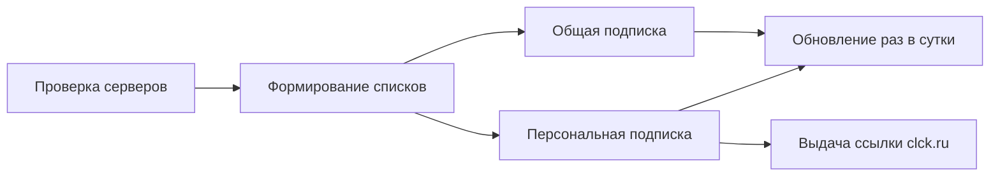

<p align="center">
  
</p>

<p align="center">
  
</p>

<div align="center">


</div>

---

<br />

<p align="center">
  
</p>

<div align="center">

Это репозиторий-**копилка** GhostShield VPN. Сюда складываются актуальные списки серверов, всё автоматически проверяется на живость и раздаётся клиентам через персональные подписки.

Всё хранится в открытом виде — осознанно. Это хранилище конфигураций, а не прод-база.

</div>

<br />

---

## 📂 Структура репозитория

| Файл | Назначение |
|---|---|
| `Black Sub` | Общая подписка **BLACK** — основной список серверов |
| `LTE Sub` | Общая подписка **LTE** — мобильный канал |
| `wi-fi(black).txt` | Wi-Fi профиль с кастомной темой Happ |
| `proxy-tg.txt` | Telegram MTProto-прокси |
| `color.txt` | Happ color-profile — кастомная тема клиента |
| `subs/` | Индивидуальные подписки `<user_id>_<profile>.txt` |

> **Данные пользователей перенесены:** `users.json`, `config.json`, `users.txt`, `block.txt` теперь живут в репозитории [`xolirx/db`](https://github.com/xolirx/db) (папка `free bot`). Здесь остаются только сервера и подписки.

---

## 🛡️ Профили

> **BLACK** — серверы в Европе, России и США. VLESS + Reality / XHTTP, канал до 10 Gbit/s.
>
> **LTE** — мобильная линейка, оптимизирована под LTE-подключения.
>
> **Happ color-profile** — кастомная тема оформления подписки в приложении **Happ**.

---

## 🔁 Жизненный цикл подписки



1. Серверы проверяются на доступность, остаются только живые конфиги
2. Формируются общие подписки `Black Sub` / `LTE Sub`
3. Для каждого клиента из `users.json` собирается своя подписка в `subs/`
4. Клиенту выдаётся персональная ссылка, привязанная к его профилям

---

## 👤 Формат пользователя

```json
"123456789": {
  "terms": true,
  "subscribed": true,
  "profiles": ["black", "lte"],
  "links": { "black": "https://clck.ru/xxx" },
  "generations": 1,
  "pinned": true
}
```

| Поле | Назначение |
|---|---|
| `terms` | Принял пользовательское соглашение |
| `subscribed` | Активна ли подписка |
| `profiles` | Доступные профили (`black` / `lte`) |
| `links` | Выданные ссылки-подписки |
| `generations` | Количество генераций подписки |
| `pinned` | Приоритетный клиент |

---

## ⚙️ Конфигурация

```json
{
  "maintenance": false,
  "version": "1.0",
  "last_updated": "2026-08-02T17:57:03"
}
```

`maintenance: true` — перевод сервиса в режим обслуживания.

---

## 🔗 Ссылки

- **Поддержка:** [@GhostShield_Support](https://t.me/GhostShield_Support)
- **Протокол:** VLESS (Reality, XHTTP, gRPC, WS)

---

<p align="center">
  
</p>

<div align="center">

`© 2026 GhostShield VPN` · `dark mode on · forever`

</div>
